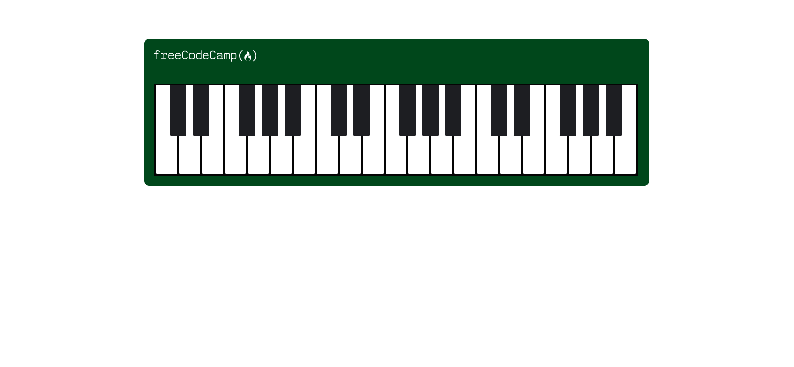

# Piano


Recréation visuelle d'un clavier de piano en HTML et CSS pur, réalisée dans le cadre du programme **Responsive Web Design** de freeCodeCamp. Le projet met l'accent sur une structure sémantique correcte et une accessibilité de base, au-delà du simple rendu visuel demandé par l'exercice d'origine.

🔗 **Démo en ligne** : [docaridr.github.io/piano-freecodecamp](https://docaridr.github.io/piano-freecodecamp/)

## Aperçu



Un clavier de quatre octaves (28 touches), avec une mise en page responsive adaptée aux écrans mobile, tablette et desktop.

## Ce que j'ai appris

    Adapter une mise en page à plusieurs tailles d'écran avec des media queries

## Technologies utilisées

- HTML5 sémantique
- CSS3 (Flexbox, media queries, pseudo-classes et pseudo-éléments)

## Installation locale

```bash
git clone https://github.com/DocariDR/piano-freecodecamp.git
cd piano-freecodecamp
```

Ouvre ensuite `index.html` dans ton navigateur, aucune dépendance requise.

## Structure du projet

```
piano-freecodecamp/
├── index.html
├── styles.css
├── piano-screenshot.png
└── README.md
```

## Auteur

**Ricardo** (DocariDR)
- GitHub : [github.com/DocariDR](https://github.com/DocariDR)
- LinkedIn : [linkedin.com/in/ricardo-dovonou](https://linkedin.com/in/ricardo-dovonou)
